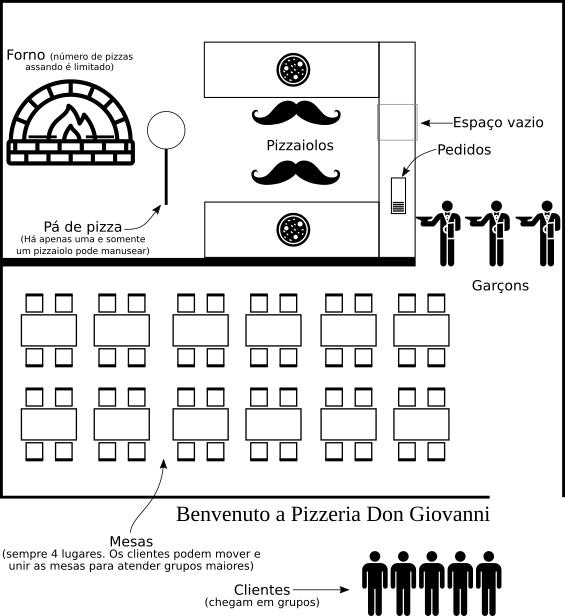
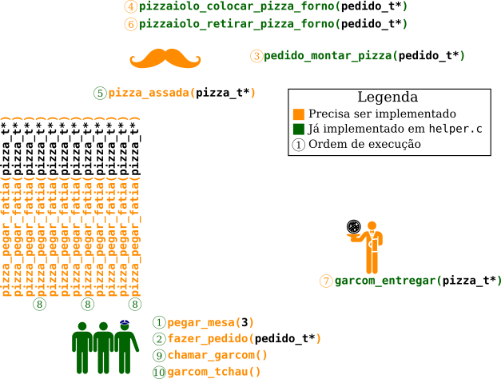

# Pizzaria Concorrente

 A ANPIRMB (Associação Nacional de Pizzarias Italianas em Regiões Metropolitanas do Brasil) contratou vocês para escrever um programa que simula uma pizzaria.




A pizzaria a ser simulada é uma pizzaria à la carte.
O funcionamento da pizzaria segue esse fluxo básico:

- Um grupo de n clientes chega na pizzaria.
- Grupos entram na pizzaria sem necessidade de autorização e competem por mesas.
  - Clientes de grupos diferentes não podem sentar na mesma mesa.
  - Todas as mesas possuem 4 lugares e podem ser movidas pelos clientes (não é necessário modelar o movimento das mesas).
  - É proibido separar as cadeiras das mesas, sentar nos cantos das mesas, sentar no chão ou comer em pé.
- Os clientes se sentam e usam um tablet deixado na mesa para fazer o pedido.
  - De acordo com a norma ANPIRMB 7894, apenas uma pizza pode ser requisitada em cada pedido.
- O pedido aparece como uma ficha em um smart deck, na cozinha.
  - As smart fichas são reutilizáveis. Depois que o pizzaiolo tira uma ficha e inicia a produção da pizza, a ficha pode ser reusada para um novo pedido.
  - Dom Giovanni não tinha muito dinheiro, então o número de smart fichas no deck é limitado.
- Os pizzaiolos processam os pedidos por ordem de chegada (o pedido mais antigo é feito antes).
- O pizzaiolo monta a pizza e, usando uma pá de pizza, a insere no forno à lenha.
- De acordo com a norma ANPIRMB 1497, o pizzaiolo deve dedicar toda sua atenção a cada pizza. Após inserir a pizza no forno, ele deve olhar para ela com carinho e monitorar os sofisticados aromas de queijo derretido com seu nariz aguçado. Quando a pizza estiver pronta, ele:
  - Retira a pizza do forno usando a pá de pizza.
  - Coloca a pizza em um local seguro, junto com um pegador.
  - Chama um garçom.
  - Quando o garçom chega, ele pega a pizza e a leva à mesa correspondente.
- O garçom leva a pizza até a mesa.
- Os clientes comem a pizza, mas de acordo com a Lei 47.574/97, os clientes devem pegar fatias da pizza usando um pegador de pizza.
  - Há apenas um desses pegadores por pizza.

## Recursos e Execução
Atentem aos seguintes recursos que devem ser gerenciados no simulador:

- 1 Pá de pizza.
- 1 Forno com capacidade para __tam_forno__ pizzas.
- __n_pizzaiolos__ pizzaiolos.
- __n_mesas__ mesas de 4 lugares.
- 1 Espaço vazio no balcão.
- 1 Deck de pedidos capaz de conter __tam_deck pedidos__.
- __n_garçons__ Garçons.
O controle de concorrência envolvendo esses recursos deve ser feito de modo a maximizar o paralelismo da pizzaria, ao mesmo tempo que as regras expostas a seguir são respeitadas.

A execução do programa recebe os parâmetros como segue:
```
./program tam_forno  n_pizzaiolos  n_mesas  n_garcons  tam_deck  n_grupos  segs_execução
```

Os últimos argumentos não representam número de recursos:

- __n_grupos__ é o número de grupos de clientes que podem chegar concorrentemente à pizzeria.
- As threads que simulam clientes e geram a chegada dos grupos são gerenciadas em __helper.c__. A função `main()` dada chama as funções (já definidas)  `helper_init()` para configurar e `pizzeria_open()` para inciar a geração de até __n_grupos__ grupos de clientes concorrentemente.
- __segs_execução__ define o tempo da simulação em segundos do mundo real (supondo que você esteja no mundo real). Cada segundo na pizzeria equivale a 1 milissegundo no mundo real.

O resultado do programa parece com isso (mensagens impressas pelo `main()` e por funções em __helper.c__):
```
$ ./program 2 2 40 3 8 40 10
Executando simulação por 10 segundos
Passados 10 segundos, fechando pizzaria
Simulação terminada!
30 pedidos feitos
30 pizzas consumidas
0 pizzas queimadas
Tempo para pegar mesas: 34 amostras, de 0.000 a 0.013 com média de 0.003
Tempo de entrega da pizza: 30 amostras, de 789.960 a 1547.549 com média de 1406.072
Tempo para chamar garçom: 60 amostras, de 0.000 a 0.003 com média de 0.001
Tempo da visita do cliente: 30 amostras, de 835.049 a 1590.032 com média de 1448.389
```
A execução do programa, usando a função `main()` fornecida no esqueleto, irá verificar o atendimento de algumas regras. __Algumas 
regras serão verificadas apenas com o script secreto dos estagiários__. Discernir o certo do errado (e quando procurar ajuda) é parte da tarefa. 
Em caso de problemas, mensagens detalhadas podem ser habilitadas usando a variável de ambiente __INE5410_INFO__:
```
INE5410_INFO=1 ./program tam_forno  n_pizzaiolos  n_mesas  n_garcons  tam_deck  n_grupos  segs_execução
```

Seguem alguns cenários de teste:

| Parâmetro    | Mini forno | Greve de Pizzaiolos | Inflação moveleira | Greve de garçons | Escassez de fichas |
|--------------|------------|---------------------|--------------------|------------------|--------------------|
| tam_forno    | 2          | 4                   | 10                 | 10               | 10                 |
| n_pizzaiolos | 10         | 2                   | 10                 | 10               | 10                 |
| n_mesas      | 40         | 40                  | 10                 | 40               | 40                 |
| n_garcons    | 40         | 40                  | 10                 | 2                | 40                 |
| tam_deck     | 40         | 40                  | 40                 | 40               | 3                  |
| n_grupos     | 40         | 40                  | 40                 | 40               | 40                 |

## Regras
Entre as regras, algumas já estão previamente implementadas.
Isto é, o __helper.c__ já garante que elas sejam cumpridas.
Por exemplo, o __helper.c__ implementa os __clientes e já garante__ o cumprimento da norma ANPIRMB 7894 (apenas uma pizza pedido e novos pedidos apenas após consumir a pizza).
__Essas regras estão listadas aqui apenas para que a solução se adeque ao comportamento do helper.c__,
que segue a regra.

### Grupos de clientes:
 - Clientes chegam em grupos de tamanhos aleatórios.
 - Cada grupo possui um líder, e apenas o líder usará o tablet ou se comunicará com os garçons, através de chamadas de funções. coração
 - O cliente líder cria e destrói os __pedido_t__.
 - O cliente líder destruirá a __pizza_t*__ chamando `free()` após seu grupo devorá-la.

### Chegada na pizzaria e pedido:
 - A função `pegar_mesas(int tam_grupo)` deve garantir que clientes de grupos diferentes não sentem na mesma mesa.
 - Clientes fazem um pedido usando o tablet da mesa usando a função `fazer_pedido(pedido_t*)`, que deve ser implementada.
 - O smart deck recebe os pedidos pela rede e deve gerar fichas respeitando a ordem em que os pedidos foram feitos.
 - O garçom deve entregar o pedido na mesa usando a função `entregar_pedido(pedido_t*)`.

### Produção de pizzas:
 - Pedidos mais antigos devem ser processados antes de pedidos mais novos.
 - Uma pizza só pode ser colocada/tirada do forno com a pá de pizza por um pizzaiolo.
 - As pizzas devem ser entregues na mesa pelo garçom.
 - Um pizzaiolo pode montar uma única pizza por vez, usando a função `pizzaiolo_montar_pizza(pedido_t*)`.
 - Um pizzaiolo não pode montar uma pizza enquanto espera outra assar.
 - Ao lado do deck de pedidos há espaço para uma pizza.
 - Clientes consomem pizzas queimadas sem reclamar.

### Comportamento à mesa:
Clientes devem pegar fatias da pizza usando exclusivamente o pegador fornecido junto com a pizza.
O pegador só pode ser usado por um cliente de cada vez.

### Saída da pizzaria:
 - Os clientes chamam o garçom com `chamar_garcom()`.
 - A função `chamar_garcom()` deve bloquear até o garçom chegar à mesa.
 - O líder do grupo de clientes pede a conta e a paga ao garçom (isso já é dado pronto).
 - Antes de sair da pizzeria, o líder do grupo de clientes se despede do garçom com a função `garcom_tchau(int tam_grupo)`, onde __tam_grupo__ é o número clientes no grupo.

### Escopo:
 - Se atente ao enunciado, alguns aspectos estão fora do escopo do simulador e não devem ser implementados (pagamento, limpeza, insumos, 
 - RH, pizzo da máfia, refrigerantes, acarajés, etc.)
 - Comportamento dos clientes já está implementado.

### Arquivos:
 - __O arquivo helper.c não deverá ser alterado. Alterações serão desfeitas automaticamente durante a correção!__
 - Não crie uma árvore de pastas com os arquivos __.c__ dentro dessas pastas, o __Makefile__ não compila arquivos dentro de pastas.
 - Você pode criar quantos arquivos __.c__ e __.h__ quiser, desde que ao lado dos já existentes.

## Funções Fornecidas
O comportamento dos clientes já é fornecido pronto e não deve ser modificado.
A função `main()` dada irá fornecer grupos de clientes à pizzaria, cada cliente na forma de uma thread (usando pthreads).
Essas threads de clientes irão interagir com funções que deverão ser implementadas (veja a próxima seção).

Algumas operações envolvidas na pizzaria também são fornecidas já implementadas.
Tentativas de alterar o comportamento dessas funções serão desfeitas pelo script corretor.

```
void pizzeria_open();
void garcom_entregar(pizza_t*);
pizza_t* pizzaiolo_montar_pizza(pedido_t*);
void pizzaiolo_colocar_pizza_forno(pizza_t*);
void pizzaiolo_retirar_pizza_forno(pizza_t*);
```

## Funções que Devem ser Implementadas
As seguintes funções serão chamadas pelas funções já implementadas ou pelos clientes.
Você deverá implementá-las como especificado.
Leve as regras listadas anteriormente em consideração.

- `void pizzeria_init(int tam_forno, int n_pizzaiolos, int n_mesas, int n_garcons, int tam_deck, int n_grupos)`:
  - Inicializa quaisquer recursos e estruturas de dados que sejam necessários antes da pizzeria poder receber clientes.
  - Chamada pela função main() antes de qualquer outra função.
- `void pizzeria_close()`:
  - Impede que novos clientes sejam aceitos e bloqueia até que os clientes dentro da pizzeria saiam voluntariamente.
  - Todo cliente que já estava sentado antes do fechamento, tem direito a receber e comer pizzas pendentes e a fazer novos pedidos.
  - Clientes que ainda não se sentaram não conseguirão sentar pois pegar_mesas retornará -1.
  - Chamada pela função main() antes de chamar pizzeria_destroy() e terminar o programa.
- `void pizzeria_destroy()`:
  - Libera quaisquer recursos e estruturas de dados inicializados por pizzeria_init().
  - Chamada pelafunção main() antes de sair.
- `void garcom_chamar()`:
  - Chama um garçom, bloqueia até o garçom chegar.
  - Chamada pelo cliente líder.
- `void fazer_pedido(pedido_t* pedido)`:
  - Faz um pedido de pizza. O pedido aparece como uma smart ficha no smart deck. É proibido fazer um novo pedido antes de receber a 
  pizza.
  - Chamado pelo cliente líder.
- `void garcom_tchau(int tam_grupo)`:
  - Indica que o grupo vai embora.
  - Chamada pelo cliente líder antes do grupo deixar a pizzaria.
- `int pizza_pegar_fatia(pizza_t* pizza)`:
  - Pega uma fatia da pizza. Retorna 0 (sem erro) se conseguiu pegar a fatia, ou -1 (erro) se a pizza já acabou.
  - Chamada pelas threads representando clientes.
- `void pizza_assada(pizza_t* pizza)`:
  - Indica que a pizza dada como argumento (previamente colocada no forno) está pronta.
  - Chamada pelo nariz do pizzaiolo.
  - A thread que chamará essa função será uma thread específica para esse fim, criada nas profundezas do helper.c.
- `int pegar_mesas(int tam_grupo)`:
  - Algoritmo para conseguir mesas suficientes para um grupo de tam_grupo pessoas. Note que vários clientes podem chamar essa função ao mesmo tempo.
  - Deve retornar zero se não houve erro, ou -1 se a pizzaria já foi fechada com pizzeria_fechar().
  - implementação não precisa considerar o layout das mesas.
  - Chamada pelo cliente líder do grupo.

Pode ser útil criar outras funções chamadas por essas ou por novas threads.

## Dicas
- As implementações de `pegar_mesas()` e `garcom_tchau()` são traiçoeiras.
- Ao executar o programa mensagens de CUIDADO: e ERRO: irão aparecer para __alguns__ problemas.
- Leaks de memória causarão descontos na nota e podem ser sintoma de algo errado.
- __Normalmente__, pizzas não queimam.
- Os dois gabaritos implementados possuem menos de 281 linhas (incluindo alguns comentários e linhas em branco).
- Use isso como parâmetros para evitar gambiarras pirotécnicas ou sofrimento prolongado, não como uma competição de code golf.


